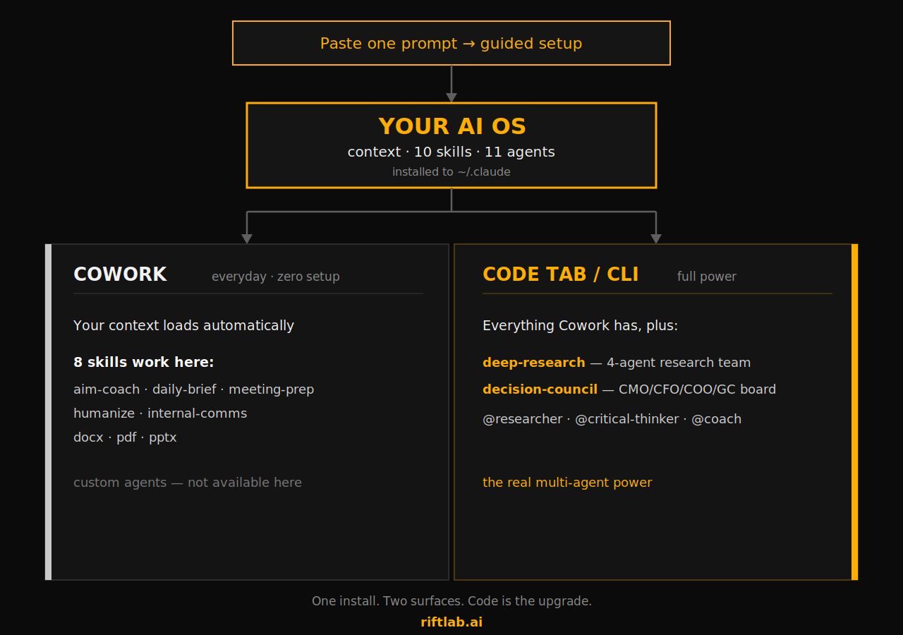

# RiftLab Personal AI OS

A personal AI operating system you install as a Claude plugin. It gives Claude a set of skills and a team of thinking agents. A one-time `/setup-my-context` skill then sets up your identity files so every session knows who you are.

Built for the AI Orchestration for Non-technical operators course at RiftLab.



## What you get

**Skills** (type `/` to run one, or let Claude reach for it):

- `/aim-coach`: coach any prompt or system instruction into shape
- `/daily-brief`: a morning brief shaped to your role and priorities
- `/meeting-prep`: a strategic brief for any upcoming meeting
- `/humanize`: rewrite AI-sounding text to match your voice
- `/deep-research`: a four-agent research team that returns verified, cited findings
- `/decision-council`: a board of advisors that pressure-tests a real decision and hands back one recommendation
- `/setup-my-context`: run once after installing to interview you and write your identity files

**Agents** that power the work: three thinking partners (researcher, critical-thinker, coach) for direct `@`-mention, plus the two skill teams (oracle, hermes, athena, scribe behind `/deep-research`; CMO, CFO, COO, GC behind `/decision-council`).

## Install

Two steps: install the plugin, then run `/setup-my-context`.

### Step 1: Install the plugin

This adds the skills and agents. Nothing in this repo is executed during install; Claude's plugin system reads the plugin and registers its components.

**Claude Desktop (Cowork):** open the Customize menu, go to the Plugins tab. Under Personal plugins, click the "+" button, choose **Add marketplace**, then **Add from a repository**, and paste:

```
https://github.com/sash-rift/riftlab-personal-os
```

Then install `riftlab-os` from the marketplace.

**Claude Code (Code tab or terminal):**

```
/plugin marketplace add sash-rift/riftlab-personal-os
/plugin install riftlab-os@riftlab
```

### Step 2: Set up your context

The plugin gives Claude capabilities. This step gives Claude *you*. After installing, run `/setup-my-context` (or just say "help me set up my context"). It interviews you and writes your identity files (CLAUDE.md, voice, rules) into a folder you pick (suggested `~/intelligence/`). Launch Claude from inside that folder and your context loads automatically.

## Where things run

The four light skills (`/aim-coach`, `/daily-brief`, `/meeting-prep`, `/humanize`) run everywhere, including Cowork. `/deep-research` and `/decision-council` run a live agent team. Use the Code tab or the CLI for those two.

## License

MIT. Open for anyone to install, use, and adapt.

## Built by

Sash Mohapatra. I build and teach AI-native work at RiftLab. This plugin runs the way I actually work: Claude in the terminal, directing a set of skills and a team of agents.

- RiftLab: https://riftlab.ai
- What I build: https://buildwithsash.com
